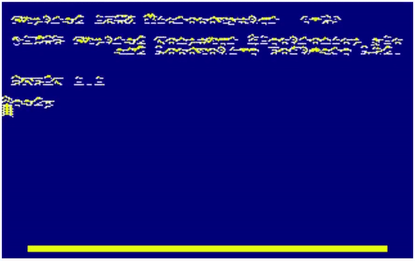

# Sand Fall

Prototype of a sand fall animation in HTML5/Javascript for later implementation on Amstrad CPC. It is a nice effect that can probably be used for a puzzle game.

## Rendering

The rendering is classically based on a 2D [`canvas`](https://www.w3schools.com/html/html5_canvas.asp) in HTML with an animation triggered by [`window.requestAnimationFrame`](https://developer.mozilla.org/en-US/docs/Web/API/window/requestAnimationFrame).

The main javascript object `PixelMap` is a generic-purpose pixel-level draw facility that accesses the raw data of an image. Because the API does not support direct pixel manipulation, the trick is to use a screenshot of the canvas using `context.getImageData`, which can be manipulated as a byte array, and to draw it back to the canvas when necessary using `context.putImageData`.

`PixelMap` features very limited draw functions like `setPixel`, `getPixel`, `fillRect`, and a `fillText` function to draw text with the original Amstrad CPC font (the complete font is included in the code as a table).

## Design

The effect mimics the Amstrad CPC colors and screen resolution. It is designed to be implemented with limited memory and CPU resource. The positions of the moving pixels are recorded in a table, and the screen data is used to test the surrounding pixels. 

When the animation begins, the screen is scanned and the position of each non-background pixel is recorded into the list as single `Particle` objects.

At each frame refresh, the `ParticleList` list is iterated from the beginning to the end and for each _(x,y)_ position, the situation of the surrounding pixels is determined:

- UP is true if the pixel at position _(x,y-1)_ is set
- DOWN is true if the pixel at position _(x,y+1)_ is set
- LEFT is true if the pixels at positions _(x-1,y)_ or _(x-1,y+1)_ are set
- RIGHT is true if the pixels at positions _(x+1,y)_ or _(x+1,y+1)_ are set

Then the displacement _(dx,dy)_ of the current `Particle` is determined with simple rules:

- if not UP and not DOWN then _dx=0, dy=1_ (free fall if no pixel set on top and bottom)
- if DOWN and not LEFT then _dx=-1, dy=1_ (slide left)
- if DOWN and not RIGHT then _dx=1, dy=1_ (slide right)
- if DOWN and not left and not RIGHT then _dx=(1 if x is even otherwise -1), dy=1_ (slide left or right with equal probability if both directions are possible)

The pixel of each `Particle` is then moved in the canvas.

## Remarks

By using a list of pixels to move, it is clear that each pixel can be moved only once per frame (this is otherwise a common pitfall if this kind of animation is using solely the information contained in the bitmap without extra list).

Nevertheless the result of the animation is a bit dependent on the ordering of the pixels in the list.
